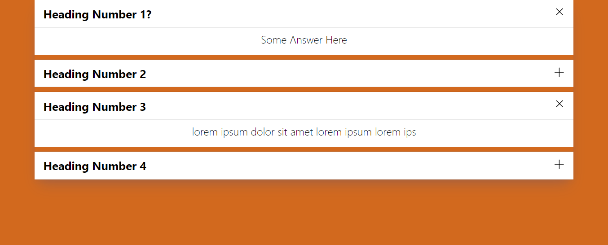
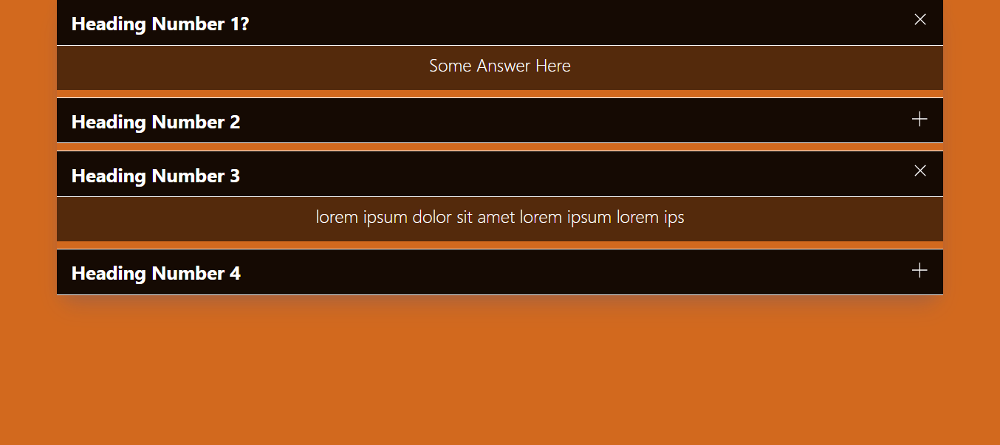
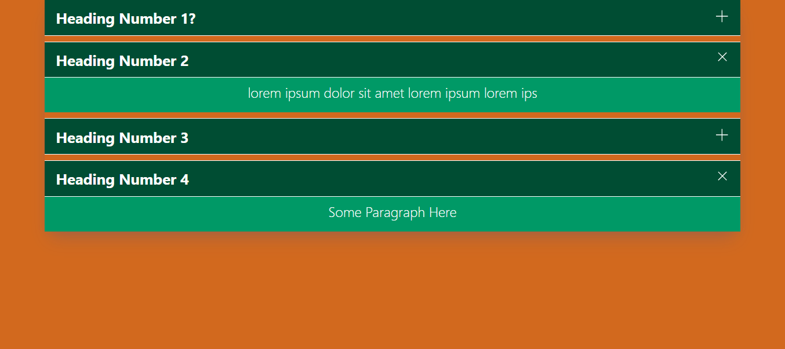

# React FAQ Accordion
### Demo:  https://react-faq-acordion-demo.vercel.app/
## Frequently Asked Questions Component for React


### How To Install?
```bash
npm i react-faq-acordion
```
### Required Props [Array] 
```
const data = [
    { title:'Heading 1',
	 paragraph: 'Some text Here'},
    { title:'Heading 2',
	 paragraph: 'Some text Here 2'}
]
```
### How To Use?
```bash
import { Acordion } from 'react-faq-acordion';

const someComponent = ()=>(
    <Acordion 
        data={data} 
        theme='Dark' 
    />
)
```
### Style
### width: 90%; margin: 0 auto;
The component is set to 90% available width and margin 0 auto.
To set a max-width wrap it in a div tag or similar with a custom max-width to your need.
### Props
|  Prop |  Type  | Is Required? | Options                |
|:-----:|:------:|:------------:|------------------------|
|  data |  Array |   Required   | Array with objects     |
| theme | String |   Optional   | dark,green,blue,purple |
#### data=[Array] :  Type = Array, Scheme in the first comments.
### theme='String' Type = String, The default theme is White. Available: dark, blue, green, purple and white (Default).

## Screenshot
Available on Github


